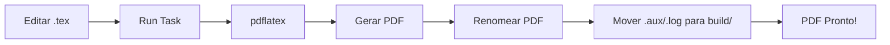

# 📖 LaTeX Articles & CV - Documentação Completa

## Índice

- [Visão Geral](#visão-geral)
- [Workflow de Compilação](#workflow-de-compilação)
- [VS Code Tasks Explicadas](#vs-code-tasks-explicadas)
- [Estrutura dos Arquivos LaTeX](#estrutura-dos-arquivos-latex)
- [Customização Avançada](#customização-avançada)
- [Troubleshooting](#troubleshooting)
- [Dicas e Truques](#dicas-e-truques)
- [FAQ](#faq)

---

## Visão Geral

Este repositório utiliza uma estrutura modular para organizar documentos LaTeX, facilitando manutenção e reutilização de código. A compilação é automatizada através de VS Code Tasks, permitindo builds com um clique.

### Filosofia do Projeto

1. **Modularidade**: Cada seção do CV está em um arquivo separado
2. **Organização**: Arquivos de build ficam em pasta dedicada
3. **Automação**: Tasks do VS Code eliminam comandos manuais
4. **Portabilidade**: Funciona em Windows, macOS e Linux

---

## Workflow de Compilação

### Processo Completo



### Etapas Detalhadas

1. **Edição**: Modifique os arquivos `.tex` nas pastas `sections/`
2. **Compilação**: Execute a task `LaTeX: Build & Organize All CVs`
3. **Processamento**:
   - `pdflatex` compila `main.tex`
   - Gera `main.pdf` temporário
   - Renomeia para nome final (ex: `CURRICULO-DIOGO-HENRIQUE-TECH-LEAD.pdf`)
   - Move arquivos auxiliares para `build/`
4. **Resultado**: PDF final na raiz, diretório limpo

---

## VS Code Tasks Explicadas

### Tasks Principais

#### 🚀 LaTeX: Build & Organize All CVs

**O que faz:**
- Compila ambos os currículos (PT-BR e EN-US) em paralelo
- Renomeia os PDFs automaticamente
- Move arquivos auxiliares para `build/`

**Quando usar:**
- Após fazer mudanças que afetam ambas as versões
- Para gerar ambos os PDFs de uma vez

**Comando equivalente:**
```bash
# Português
cd curriculo && pdflatex main.tex
Rename-Item main.pdf CURRICULO-DIOGO-HENRIQUE-TECH-LEAD.pdf
Move-Item *.aux,*.log,*.out build/

# Inglês
cd curriculo_en && pdflatex main.tex
Rename-Item main.pdf RESUME-DIOGO-HENRIQUE-TECH-LEAD.pdf
Move-Item *.aux,*.log,*.out build/
```

#### 📝 LaTeX: Build & Organize CV (Portuguese)

**O que faz:**
- Compila apenas o currículo em português
- Organiza arquivos automaticamente

**Quando usar:**
- Mudanças apenas na versão PT-BR
- Testes rápidos

#### 📄 LaTeX: Build & Organize CV (English)

**O que faz:**
- Compila apenas o currículo em inglês
- Organiza arquivos automaticamente

**Quando usar:**
- Mudanças apenas na versão EN-US
- Testes rápidos

#### 🧹 LaTeX: Clean Build Artifacts

**O que faz:**
- Remove todos os arquivos auxiliares das pastas `build/`
- Mantém os PDFs finais

**Quando usar:**
- Limpar cache de compilação
- Resolver problemas de compilação
- Antes de commit no Git

#### ⚠️ LaTeX: Clean All (Including PDFs)

**O que faz:**
- Remove TUDO: PDFs e arquivos auxiliares
- Deixa apenas os arquivos fonte `.tex`

**Quando usar:**
- Rebuild completo do zero
- Limpar completamente o repositório

---

## 🎮 Launch Configurations

### O que são Launch Configurations?

Launch Configurations são atalhos rápidos para executar tarefas diretamente do painel "Run and Debug" do VS Code. Elas oferecem uma maneira visual e intuitiva de compilar seus CVs.

### Configurações Disponíveis

#### 🇧🇷 Compilar CV Português

**Como usar:**
1. Pressione `F5` ou clique no ícone "Run and Debug" (▶️) na barra lateral
2. Selecione `🇧🇷 Compilar CV Português` no dropdown
3. Clique no botão verde de play ou pressione `F5`

**O que faz:**
- Executa a task `LaTeX: Build & Organize CV (Portuguese)`
- Compila `curriculo/main.tex`
- Renomeia para `CURRICULO-DIOGO-HENRIQUE-TECH-LEAD.pdf`
- Move arquivos auxiliares para `build/`

#### 🇺🇸 Compile CV English

**Como usar:**
1. Pressione `F5` ou clique no ícone "Run and Debug" (▶️)
2. Selecione `🇺🇸 Compile CV English`
3. Pressione `F5`

**O que faz:**
- Executa a task `LaTeX: Build & Organize CV (English)`
- Compila `curriculo_en/main.tex`
- Renomeia para `RESUME-DIOGO-HENRIQUE-TECH-LEAD.pdf`
- Move arquivos auxiliares para `build/`

#### 🌎 Compilar Ambos os CVs / Compile Both CVs

**Como usar:**
1. Pressione `F5` ou clique no ícone "Run and Debug" (▶️)
2. Selecione `🌎 Compilar Ambos os CVs / Compile Both CVs`
3. Pressione `F5`

**O que faz:**
- Executa a task `LaTeX: Build & Organize All CVs`
- Compila ambos os currículos em paralelo
- Organiza todos os arquivos

### Diferença entre Tasks e Launch Configurations

| Aspecto | Tasks | Launch Configurations |
|---------|-------|----------------------|
| **Acesso** | `Ctrl+Shift+P` → `Tasks: Run Task` | `F5` ou painel "Run and Debug" |
| **Visual** | Lista de texto | Dropdown com ícones |
| **Atalho** | `Ctrl+Shift+B` (default task) | `F5` (última configuração) |
| **Uso** | Mais opções, mais controle | Mais rápido, mais visual |

### Dica de Produtividade

💡 **Workflow recomendado:**
1. Configure sua launch configuration favorita (ex: 🌎 Compilar Ambos)
2. Use `F5` sempre que quiser compilar
3. Use tasks específicas apenas quando precisar de controle fino

---

## Estrutura dos Arquivos LaTeX

### Anatomia do main.tex

```latex
\documentclass[11pt, a4paper]{article}

% Importar configurações
\input{config/packages.tex}    % Pacotes LaTeX
\input{config/styles.tex}      % Estilos customizados

\begin{document}

% Importar seções
\input{sections/header.tex}     % Cabeçalho
\input{sections/summary.tex}    % Resumo
\input{sections/experience.tex} % Experiência
\input{sections/education.tex}  % Formação
\input{sections/skills.tex}     % Habilidades
\input{sections/projects.tex}   % Publicações

\end{document}
```

### Arquivos de Configuração

#### config/packages.tex

Define todos os pacotes LaTeX utilizados:

```latex
\usepackage[utf8]{inputenc}      % Codificação UTF-8
\usepackage[T1]{fontenc}         % Fontes
\usepackage[brazilian]{babel}    % Idioma PT-BR
\usepackage{geometry}            % Margens
\usepackage{hyperref}            % Links
\usepackage{fontawesome5}        % Ícones
```

**Personalização:**
- Mudar idioma: `\usepackage[english]{babel}`
- Ajustar margens: `\usepackage[margin=2cm]{geometry}`

#### config/styles.tex

Define cores, comandos customizados e formatação:

```latex
% Cores
\definecolor{primary}{RGB}{0, 102, 204}
\definecolor{secondary}{RGB}{80, 80, 80}

% Comandos customizados
\newcommand{\experience}[4]{...}
\newcommand{\education}[3]{...}
```

**Personalização:**
- Mudar cores: Altere os valores RGB
- Criar novos comandos: Use `\newcommand`

### Arquivos de Seções

Cada seção é um arquivo `.tex` independente:

#### sections/header.tex
- Nome
- Título profissional
- Informações de contato

#### sections/summary.tex
- Resumo profissional
- Principais qualificações

#### sections/experience.tex
- Experiências profissionais
- Usa comando `\experience{cargo}{empresa}{período}{descrição}`

#### sections/education.tex
- Formação acadêmica
- Usa comando `\education{curso}{instituição}{período}`

#### sections/skills.tex
- Habilidades técnicas
- Organizadas por categoria

#### sections/projects.tex
- Publicações
- Projetos relevantes

---

## Customização Avançada

### Adicionar Nova Seção

1. **Criar arquivo**: `sections/nova-secao.tex`
   ```latex
   \section{Nova Seção}
   Conteúdo aqui...
   ```

2. **Incluir no main.tex**:
   ```latex
   \input{sections/nova-secao.tex}
   ```

### Mudar Fonte

Em `config/packages.tex`:

```latex
% Fonte padrão (Latin Modern)
\usepackage{lmodern}

% OU Libertine (mais elegante)
\usepackage{libertine}

% OU Times New Roman
\usepackage{times}

% OU Palatino
\usepackage{palatino}
```

### Ajustar Espaçamento

Em `config/styles.tex`:

```latex
% Espaçamento entre seções
\titlespacing{\section}{0pt}{10pt}{8pt}
%                        ^    ^     ^
%                        |    |     └─ Espaço após
%                        |    └─ Espaço antes
%                        └─ Indentação

% Espaçamento entre itens
\setlist[itemize]{itemsep=2pt}
```

### Criar Comando Customizado

Em `config/styles.tex`:

```latex
% Exemplo: Comando para certificação
\newcommand{\certification}[3]{
  \subsection*{#1 \hfill {\normalsize\color{secondary}#3}}
  \textit{\color{secondary}#2}
  \vspace{8pt}
}
```

Uso em `sections/education.tex`:
```latex
\certification{AWS Certified Solutions Architect}{Amazon Web Services}{2024}
```

### Mudar Layout de Página

Em `config/packages.tex`:

```latex
% Margens padrão
\usepackage[a4paper, margin=1.5cm]{geometry}

% Margens maiores
\usepackage[a4paper, margin=2.5cm]{geometry}

% Margens assimétricas
\usepackage[a4paper, top=2cm, bottom=2cm, left=2.5cm, right=2cm]{geometry}
```

---

## Troubleshooting

### Problema: "pdflatex: command not found"

**Causa**: LaTeX não está instalado ou não está no PATH

**Solução**:
1. Instale uma distribuição LaTeX:
   - Windows: [MiKTeX](https://miktex.org/)
   - macOS: [MacTeX](https://www.tug.org/mactex/)
   - Linux: `sudo apt-get install texlive-full`
2. Reinicie o VS Code
3. Verifique: `pdflatex --version` no terminal

### Problema: Ícones não aparecem

**Causa**: Pacote `fontawesome5` requer XeLaTeX ou LuaLaTeX

**Solução**:
1. Compile com XeLaTeX:
   ```bash
   xelatex main.tex
   ```
2. OU remova ícones de `sections/header.tex`:
   ```latex
   % De:
   \faEnvelope\ email@example.com
   % Para:
   email@example.com
   ```

### Problema: Erro "File not found: config/packages.tex"

**Causa**: Caminho relativo incorreto

**Solução**:
1. Certifique-se de estar no diretório correto:
   ```bash
   cd curriculo  # ou curriculo_en
   ```
2. Verifique se a estrutura de pastas está correta
3. Compile a partir do diretório que contém `main.tex`

### Problema: PDF não atualiza

**Causa**: Arquivo PDF está aberto em outro programa

**Solução**:
1. Feche o PDF em outros visualizadores
2. Use o visualizador integrado do VS Code (LaTeX Workshop)
3. No Windows, use SumatraPDF (permite recompilação com arquivo aberto)

### Problema: Caracteres especiais aparecem errados

**Causa**: Codificação incorreta

**Solução**:
1. Certifique-se de que `config/packages.tex` tem:
   ```latex
   \usepackage[utf8]{inputenc}
   \usepackage[T1]{fontenc}
   ```
2. Salve arquivos `.tex` com codificação UTF-8
3. No VS Code: `File > Preferences > Settings` → procure "encoding" → defina como UTF-8

### Problema: Compilação lenta

**Causa**: Muitas imagens ou pacotes pesados

**Solução**:
1. Use `pdflatex` em vez de `xelatex` ou `lualatex`
2. Compile apenas quando necessário (não use auto-build)
3. Remova pacotes não utilizados de `config/packages.tex`

---

## Dicas e Truques

### Atalhos de Teclado

| Atalho | Ação |
|--------|------|
| `F5` | Executar última launch configuration |
| `Ctrl+Shift+B` | Run default build task |
| `Ctrl+Shift+P` → `Tasks: Run Task` | Escolher task específica |
| `Ctrl+Alt+V` | Visualizar PDF (LaTeX Workshop) |
| `Ctrl+Alt+J` | Sincronizar PDF com código (SyncTeX) |

### Visualização Rápida

Com LaTeX Workshop instalado:
1. Abra `main.tex`
2. Clique no ícone de olho no canto superior direito
3. PDF abre em painel lateral
4. Atualiza automaticamente após compilação

### Compilação Incremental

Para compilações mais rápidas durante edição:

1. Use a task `LaTeX: Compile CV (Portuguese)` (sem organizar)
2. Organize arquivos apenas quando finalizar
3. Ou use LaTeX Workshop com auto-build (mais lento, mas automático)

### Controle de Versão (Git)

**Antes de commit:**
```bash
# Limpar arquivos de build
Ctrl+Shift+P → Tasks: Run Task → LaTeX: Clean Build Artifacts
```

**Arquivos para commitar:**
- ✅ `*.tex` (arquivos fonte)
- ✅ `.vscode/` (configurações)
- ✅ `config/` (configurações LaTeX)
- ✅ `sections/` (conteúdo)
- ❌ `*.pdf` (opcional, depende do uso)
- ❌ `build/` (ignorado por .gitignore)

### Backup Automático

Configure auto-save no VS Code:
```json
{
  "files.autoSave": "afterDelay",
  "files.autoSaveDelay": 1000
}
```

### Snippets Úteis

Crie snippets personalizados em VS Code:

1. `Ctrl+Shift+P` → `Preferences: Configure User Snippets`
2. Escolha `latex.json`
3. Adicione:

```json
{
  "Experience Item": {
    "prefix": "exp",
    "body": [
      "\\experience{${1:Cargo}}{${2:Empresa}}{${3:Período}}{",
      "  \\begin{itemize}",
      "    \\item ${4:Descrição}",
      "  \\end{itemize}",
      "}"
    ]
  }
}
```

Uso: Digite `exp` + `Tab` em arquivo `.tex`

---

## FAQ

### P: Posso usar este template para artigos científicos?

**R**: Sim! A estrutura modular funciona perfeitamente para artigos. Crie uma pasta `artigos/` e adapte as seções conforme necessário.

### P: Como adicionar bibliografia?

**R**: 
1. Crie arquivo `references.bib`
2. Em `config/packages.tex`, adicione:
   ```latex
   \usepackage[backend=biber]{biblatex}
   \addbibresource{references.bib}
   ```
3. No `main.tex`, adicione antes de `\end{document}`:
   ```latex
   \printbibliography
   ```
4. Compile com: `pdflatex → biber → pdflatex → pdflatex`

### P: Posso usar em Overleaf?

**R**: Sim! Faça upload dos arquivos para Overleaf. As tasks do VS Code não funcionarão, mas a estrutura modular funciona perfeitamente.

### P: Como exportar para Word?

**R**: Use `pandoc`:
```bash
pandoc main.tex -o curriculo.docx
```

Nota: Formatação pode ser perdida. Para melhor resultado, use PDF.

### P: Posso mudar o nome dos arquivos PDF?

**R**: Sim! Edite `.vscode/tasks.json`:
```json
{
  "args": [
    "-Command",
    "Rename-Item -Path main.pdf -NewName SEU-NOME-AQUI.pdf ..."
  ]
}
```

### P: Como adicionar imagens?

**R**:
1. Coloque imagem em `images/foto.jpg`
2. Em `sections/header.tex`:
   ```latex
   \includegraphics[width=3cm]{images/foto.jpg}
   ```
3. Em `config/packages.tex`, certifique-se de ter:
   ```latex
   \usepackage{graphicx}
   ```

---

## Recursos Adicionais

### Documentação LaTeX

- [Overleaf Documentation](https://www.overleaf.com/learn)
- [LaTeX Wikibook](https://en.wikibooks.org/wiki/LaTeX)
- [CTAN - Comprehensive TeX Archive Network](https://ctan.org/)

### Ferramentas Úteis

- [Detexify](http://detexify.kirelabs.org/classify.html) - Desenhe símbolos para encontrar comandos LaTeX
- [Tables Generator](https://www.tablesgenerator.com/) - Gerador visual de tabelas LaTeX
- [Mathpix](https://mathpix.com/) - Converte equações de imagens para LaTeX

### Comunidade

- [TeX StackExchange](https://tex.stackexchange.com/) - Q&A sobre LaTeX
- [r/LaTeX](https://www.reddit.com/r/LaTeX/) - Subreddit sobre LaTeX

---

<div align="center">

**Precisa de mais ajuda?**

[Abra uma issue](https://github.com/seu-usuario/latex-articles-cv/issues) | [Contribua](CONTRIBUTING.md)

</div>
